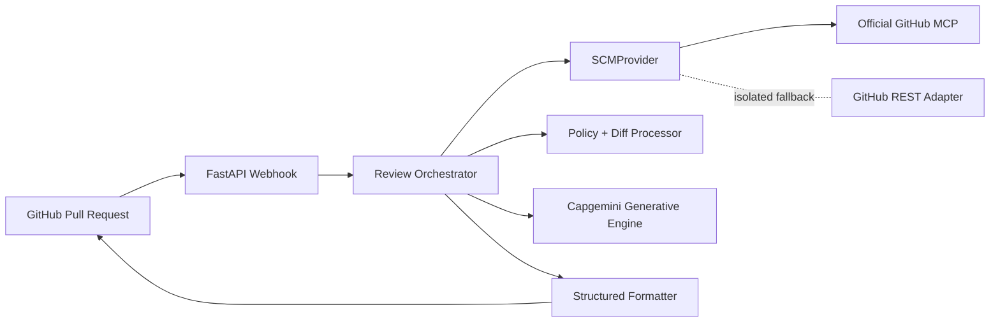

# AI Code Review Agent

An enterprise-style Python proof of concept that receives GitHub pull request webhooks, validates them, retrieves bounded diffs through an SCM abstraction, applies a policy-driven AI review, validates structured findings, and posts one idempotent summary comment.

## What is included

- FastAPI webhook receiver with HMAC SHA-256 validation.
- Multi-repository allowlisting via `ALLOWED_REPOSITORIES`.
- Concurrent-safe request context using FastAPI background tasks and no PR-global mutable state.
- Official GitHub MCP configuration in `.vscode/mcp.json`.
- FastAPI-owned official MCP Python client over Streamable HTTP.
- `GitHubMCPProvider` uses MCP by default; REST is an explicitly controlled fallback.
- Capgemini Generative Engine OpenAI-compatible client using `GEP_API_KEY`.
- Mock mode for a credential-free demo and pytest tests with no real network calls.
- Bounded file count, diff size, total prompt size, ignored generated files, binary exclusion, and idempotency markers.

## Architecture



The current official GitHub MCP server is `github/github-mcp-server`. The FastAPI service uses the official MCP Python SDK over remote Streamable HTTP at `https://api.githubcopilot.com/mcp/`. Docker, Docker Desktop, local containers, and npx are not required. REST fallback is disabled by default and can only be enabled explicitly with `GITHUB_REST_FALLBACK=true`.

For a local MCP process, set `GITHUB_MCP_TRANSPORT=stdio`. The client starts the configured command and passes `GITHUB_MCP_TOKEN` to it as `GITHUB_PERSONAL_ACCESS_TOKEN`:

```powershell
$env:GITHUB_MCP_TRANSPORT = "stdio"
$env:GITHUB_MCP_COMMAND = "npx"
$env:GITHUB_MCP_ARGS = "-y @modelcontextprotocol/server-github"
```

The local server must expose the current tools configured by `GITHUB_MCP_TOOLS` (by default `pull_request_read,add_issue_comment`). The older npm example using `get_pull_request` and `create_pull_request_review` is not compatible with this provider without an additional legacy adapter.

## Setup in PowerShell

```powershell
cd "C:\Users\MAHALAKS\OneDrive - Capgemini\Desktop\GenAI Launchpad\AI_Code_Review_Agent"
py -3.11 -m venv .venv
.\.venv\Scripts\Activate.ps1
python -m pip install -r requirements.txt
Copy-Item .env.example .env
```

Edit `.env` and add your real `GEP_API_KEY`, `GITHUB_TOKEN`, and `GITHUB_WEBHOOK_SECRET`. Keep `.env` local; it is git-ignored. For a credential-free smoke demo leave `MOCK_EXTERNAL_SERVICES=true` and use a signed test request. Set `MOCK_EXTERNAL_SERVICES=false` for real model calls and set `MODEL_NAME` to an approved catalog name, for example `openai.gpt-5-mini`.

Start the service:

```powershell
python -m uvicorn app.main:app --reload --port 8000
```

Set a rotated GitHub token in `.env` as `GITHUB_MCP_TOKEN`. The local setup uses stdio. If PowerShell previously defined `SCM_PROVIDER` or `GITHUB_MCP_TRANSPORT`, clear the old process overrides before starting:

```powershell
Remove-Item Env:SCM_PROVIDER -ErrorAction SilentlyContinue
Remove-Item Env:GITHUB_MCP_TRANSPORT -ErrorAction SilentlyContinue
```

The application starts only after the official remote MCP server connects and required tools are discovered. This is intentional: with `GITHUB_REST_FALLBACK=false`, a failed MCP connection must not silently become a REST review.

Health check: `http://localhost:8000/health`.

## GitHub webhook and ngrok

```powershell
ngrok http 8000
```

Configure a GitHub webhook with the HTTPS ngrok URL plus `/webhooks/github`, content type `application/json`, the same secret as `.env`, and the `Pull requests` event. The original `/webhook/github` path remains supported for compatibility. Use `opened`, `reopened`, `synchronize`, and `ready_for_review`; draft PRs are skipped by default. For production, use controlled ingress, TLS, rate limiting, durable queues, and a secret store rather than ngrok.

## Testing

```powershell
pytest -q
```

Expected behavior is a green suite with tests for signatures, event filtering, draft handling, prompt defense, multi-repository configuration, formatting, malformed model output, diff limits, and idempotent orchestration. Tests never call GitHub or the Generative Engine.

## Environment variables

| Variable | Purpose |
|---|---|
| `OPENAI_BASE_URL` | Capgemini Generative Engine endpoint |
| `GEP_API_KEY` | Model credential, never logged |
| `MODEL_NAME` | Approved model catalog identifier |
| `GITHUB_TOKEN` | Least-privilege GitHub token for the REST fallback |
| `GITHUB_MCP_TOKEN` | GitHub token passed to the MCP client or local stdio server |
| `GITHUB_MCP_TRANSPORT` | MCP transport: `http` (default) or `stdio` |
| `GITHUB_MCP_COMMAND`, `GITHUB_MCP_ARGS` | Local stdio server command and shell-style arguments |
| `GITHUB_MCP_TOOLS` | Comma-separated MCP tools required at startup |
| `GITHUB_WEBHOOK_SECRET` | HMAC webhook secret |
| `ALLOWED_REPOSITORIES` | Comma-separated `owner/repo` values or `*` for demo |
| `ALLOW_DRAFT_REVIEWS` | Explicitly enable draft review processing |
| `MAX_FILES`, `MAX_FILE_DIFF_CHARS`, `MAX_REVIEW_INPUT_CHARS` | Large PR controls |
| `MOCK_EXTERNAL_SERVICES` | Return deterministic demo output without external calls |

## Review output

Every comment contains a decision, risk, severity counts, detailed findings, scope, categories reviewed, remediation, and an AI disclaimer. It never approves or merges a PR. A hidden commit marker prevents repeated comments for the same SHA. The in-memory delivery set is POC-only; production should use durable storage or a queue-backed idempotency record.

## Security and limitations

Use a fine-grained GitHub token with only the repository permissions required to read pull requests and create issue comments. Source code is untrusted input and is explicitly separated from review instructions. Do not send complete repositories to the model. The POC does not provide durable queues, persistent idempotency, full MCP SDK invocation from the service, or enterprise secret-store integration; those are the production hardening steps documented in `docs/security.md`.

See `docs/setup-guide.md`, `docs/architecture.md`, `docs/demo-guide.md`, `docs/demo-questions.md`, and `docs/troubleshooting.md` for the rest of the walkthrough.
