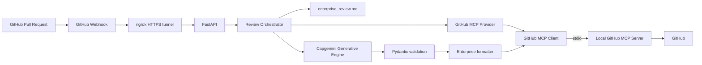
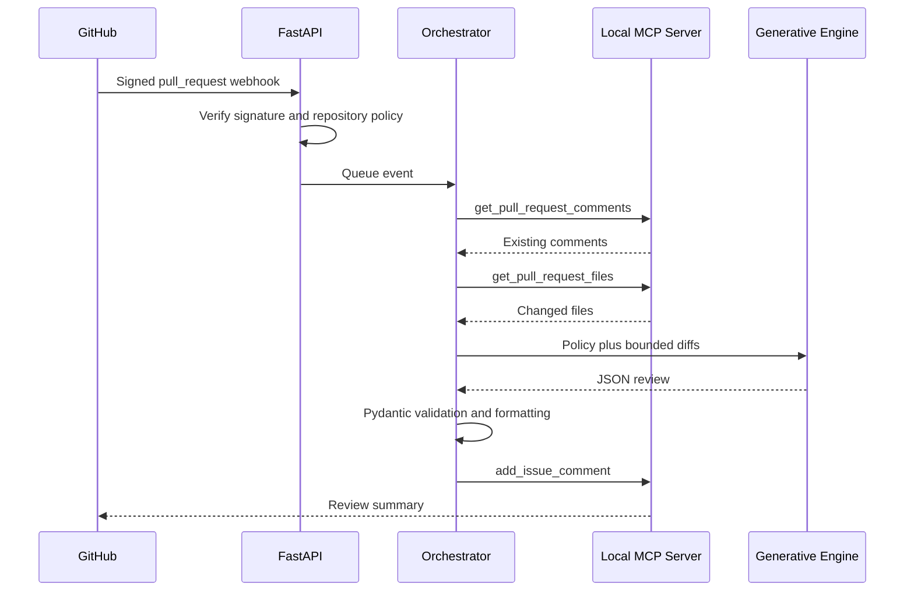

# AI Code Review Agent

## Problem Statement

Pull-request review is valuable but repetitive. Teams need consistent security, architecture, testing, and maintainability checks without sending complete repositories to a model or bypassing human approval.

## Solution

This POC receives signed GitHub pull-request webhooks, retrieves bounded changed files through a local GitHub MCP Server over stdio, applies an enterprise Markdown policy, calls the Capgemini Generative Engine, validates the structured response with Pydantic, and posts one formatted summary comment back through MCP.

## Key Features

- HMAC-SHA256 webhook validation.
- Repository allowlisting with explicit repositories or `*` for a controlled demo.
- Local stdio MCP with startup tool discovery.
- Required tools: `get_pull_request_comments`, `get_pull_request_files`, and `add_issue_comment`.
- Duplicate-review prevention using commit markers and delivery tracking.
- Bounded files and diffs with generated, lock, and binary files skipped.
- Prompt-injection boundary for repository content.
- Structured model output validation and enterprise review formatting.
- FastAPI health endpoint at `/health`.

## Final Architecture



Webhook transport is HTTP. GitHub operations use MCP. MCP transport is local stdio. AI inference uses the Capgemini Generative Engine HTTP API. ngrok only exposes the local webhook endpoint during the POC.

## Agent Flow



## Technology Stack

- Python 3.11+
- FastAPI and Uvicorn
- Pydantic and pydantic-settings
- Official MCP Python SDK
- Local `npx @modelcontextprotocol/server-github`
- `httpx` for the OpenAI-compatible Generative Engine API
- pytest and pytest-asyncio
- ngrok for local webhook exposure

## Where MCP Is Used

MCP is used by `GitHubMCPClient` and `GitHubMCPProvider` for all GitHub operations:

1. Discover required tools at startup.
2. Read existing PR comments.
3. Read changed PR files.
4. Post the formatted review comment.

There is no direct GitHub REST implementation in the final POC.

## Why MCP Instead of Direct GitHub REST

MCP provides a standard tool contract and keeps GitHub operations behind a governed provider boundary. The POC demonstrates tool discovery and tool invocation explicitly in runtime logs. Direct REST code was removed from the final project so there is one obvious GitHub integration path.

## Local Stdio MCP

The FastAPI process starts the configured local command, normally `npx`, and passes `GITHUB_MCP_TOKEN` to the child process as `GITHUB_PERSONAL_ACCESS_TOKEN`. The client initializes a `ClientSession`, discovers tools, and keeps the session alive for webhook processing.

## Capgemini Generative Engine

`LLMClient` sends policy, PR metadata, and bounded changed-file diffs to the configured OpenAI-compatible `/chat/completions` endpoint. It does not send a complete repository. The response must be JSON matching the review schema.

## Enterprise Review Standards

The policy is maintained in [app/rules/enterprise_review.md](app/rules/enterprise_review.md). It defines categories, severity guidance, evidence expectations, remediation quality, and the rule that the agent never approves or merges a pull request.

## Enterprise Review Format

The comment contains a decision, risk level, severity counts, detailed findings, categories reviewed, scope counts, remediation guidance, an AI disclaimer, and a hidden commit marker.

## Multi-Repository Support

Each webhook creates a `PullRequestEvent` containing owner, repository, PR number, branch, commit SHA, and delivery ID. `ALLOWED_REPOSITORIES` accepts comma-separated repository names or `*`. Repository matching is case-insensitive and supports both `owner/repo` and repository-name matching.

## Duplicate-Review Prevention

Before model processing, the orchestrator searches PR comments for `<!-- ai-code-review-agent:<commit-sha> -->`. The webhook handler also tracks delivery IDs in memory. These controls are POC-level safeguards; production should use durable idempotency storage.

## Security

- Verify `X-Hub-Signature-256` before parsing payload data.
- Keep credentials in environment variables or a secret manager.
- Use a least-privilege GitHub token for the local MCP server.
- Treat PR content as untrusted data, not instructions.
- Bound files, diffs, and model input.
- Validate model output before posting.
- Never automatically approve, merge, or deploy code.
- Do not log credentials or authorization headers.

## Project Structure

```text
app/
  main.py
  api/webhook.py
  core/{config.py,logging_config.py,security.py}
  llm/client.py
  mcp/github_client.py
  models/{review.py,webhook.py}
  rules/enterprise_review.md
  scm/{base.py,github_mcp.py}
  services/{diff_processor.py,orchestrator.py,prompt_builder.py,review_formatter.py}
tests/
docs/
.env.example
requirements.txt
pytest.ini
```

## Environment Configuration

Copy `.env.example` to `.env` and provide values for:

| Variable | Purpose |
|---|---|
| `OPENAI_BASE_URL` | Capgemini Generative Engine base URL |
| `GEP_API_KEY` | Generative Engine credential |
| `MODEL_NAME` | Approved model identifier |
| `GITHUB_WEBHOOK_SECRET` | GitHub webhook signing secret |
| `ALLOWED_REPOSITORIES` | Comma-separated repositories or `*` for demo |
| `ALLOW_DRAFT_REVIEWS` | Whether draft PRs are processed |
| `GITHUB_MCP_TOKEN` | Token passed to the local MCP server |
| `GITHUB_MCP_TOOLS` | Required MCP tools |
| `GITHUB_MCP_COMMAND` | Local MCP command, normally `npx` |
| `GITHUB_MCP_ARGS` | Shell-style MCP command arguments |
| `LOG_LEVEL` | Application log level |
| `MAX_FILES` | Maximum files sent to review |
| `MAX_FILE_DIFF_CHARS` | Maximum diff characters per file |
| `MAX_REVIEW_INPUT_CHARS` | Maximum total diff characters |
| `REVIEW_TIMEOUT_SECONDS` | MCP/model timeout setting |
| `MOCK_EXTERNAL_SERVICES` | Credential-free model demo mode |

## Installation

```powershell
py -3.11 -m venv .venv
.\.venv\Scripts\Activate.ps1
python -m pip install -r requirements.txt
Copy-Item .env.example .env
```

Fill in `.env` without committing it. `.env` is ignored by Git.

## How to Start the POC

```powershell
.\.venv\Scripts\Activate.ps1
python -m uvicorn app.main:app --reload --port 8000
```

The application starts only after the local MCP server connects and the required tools are discovered.

## How to Start ngrok

In a second PowerShell window:

```powershell
ngrok http 8000
```

Use the HTTPS forwarding URL in the GitHub webhook configuration.

## GitHub Webhook Configuration

Configure:

- Payload URL: `<ngrok-https-url>/webhooks/github`
- Content type: `application/json`
- Secret: the value of `GITHUB_WEBHOOK_SECRET`
- Event: `Pull requests`

The service accepts `/webhooks/github` and the compatibility path `/webhook/github`.

## How to Create and Test a PR

1. Create or update a test branch.
2. Open a pull request in an allowed repository.
3. Use an action such as `opened`, `reopened`, `synchronize`, or `ready_for_review`.
4. Watch the FastAPI terminal.
5. Inspect the generated summary comment on the PR.

## Expected Terminal Logs

```text
github_mcp_connecting transport=stdio endpoint=local
github_mcp_connected
github_mcp_tools_discovered count=...
github_mcp_tool_call tool=get_pull_request_comments
github_mcp_tool_success tool=get_pull_request_comments
github_mcp_tool_call tool=get_pull_request_files
github_mcp_tool_success tool=get_pull_request_files
github_mcp_tool_call tool=add_issue_comment
github_mcp_tool_success tool=add_issue_comment
review_posted repository=owner/repo pr=...
review_finished ... result=posted
```

## Testing

```powershell
pytest -q
```

Tests use mocks and do not call GitHub, the MCP server, or the Generative Engine.

## Troubleshooting

See [docs/troubleshooting.md](docs/troubleshooting.md) for MCP startup, authentication, webhook, ngrok, model, and validation failures.

## POC Limitations

- Delivery tracking and idempotency are in memory.
- FastAPI background tasks are not a durable queue.
- ngrok is not production ingress.
- The local MCP subprocess requires Node.js and `npx`.
- Human review remains required.

## Production Evolution

Use managed ingress, a durable queue, durable idempotency, a secret manager, workload identity, monitoring, audit trails, controlled egress, and a managed MCP execution environment.

## Future Azure DevOps Integration

The provider boundary is the extension point for a future Azure DevOps MCP provider. Azure DevOps is not part of this POC runtime.
