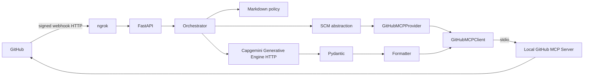

# AI Code Review Agent Documentation

## Executive Summary

The AI Code Review Agent is a FastAPI proof of concept that reviews GitHub pull requests using a local GitHub MCP Server over stdio and the Capgemini Generative Engine. It retrieves only bounded changed-file context, applies an enterprise Markdown policy, validates structured model output, and posts one summary comment through MCP.

## Business Problem

Manual reviews must balance speed, consistency, security, and limited engineering attention. The POC automates repeatable analysis while preserving human approval and repository controls.

## Objectives

- Demonstrate a working GitHub webhook-to-review flow.
- Use MCP for all GitHub operations.
- Keep policy, retrieval, inference, validation, and formatting separable.
- Bound data sent to the model.
- Produce a repeatable enterprise-style review comment.

## Scope

Included: GitHub pull-request webhooks, local stdio MCP, comments and changed files, policy-driven model review, Pydantic validation, formatted comments, repository authorization, and POC logging.

Excluded: automatic merge or approval, durable queues, durable idempotency, managed ingress, production secret management, and Azure DevOps runtime support.

## Final Architecture

## End-to-End Flow

1. GitHub sends a pull-request webhook through ngrok.
2. FastAPI verifies the HMAC signature and parses the event.
3. The handler checks action, delivery, repository authorization, and draft status.
4. The orchestrator searches comments for the commit marker.
5. The MCP provider retrieves changed files.
6. The diff processor applies file and input bounds.
7. The prompt builder combines policy, metadata, and selected diffs.
8. The Generative Engine returns JSON.
9. Pydantic validates the response.
10. The formatter creates the enterprise comment.
11. MCP posts it with `add_issue_comment`.

## Component Responsibilities

### Webhook

`app/webhook.py` authenticates and routes supported pull-request events. It accepts `/webhooks/github` and a compatibility singular path.

### FastAPI

`app/main.py` owns application lifespan, local MCP startup and cleanup, and `/health`.

### Orchestrator

`app/reviewer.py` owns the review workflow and commit-marker idempotency check.

### SCM Abstraction

`app/models.py` defines `ChangedFile`, `PullRequestEvent`, and the structured review contracts used by the workflow.

### GitHubMCPProvider

`app/github_mcp.py` owns the MCP client, provider operations, tool calls, and conversion of file responses into `ChangedFile` objects.

### GitHubMCPClient

`app/github_mcp.py` starts the configured local process, passes the token through the environment, initializes `ClientSession`, discovers tools, invokes tools, extracts structured or text content, and closes the process cleanly.

### Stdio Transport

Stdio is the communication channel between the Python MCP client and the local GitHub MCP Server. It is not the webhook transport and not the model transport.

### MCP Tools

- `get_pull_request_comments` supports duplicate-review detection.
- `get_pull_request_files` supplies changed files and patches.
- `add_issue_comment` posts the final review.

### Enterprise Review Markdown

`app/rules/enterprise_review.md` contains review categories, severity guidance, evidence expectations, and governance rules. It is loaded by `PromptBuilder`.

### Prompt Builder

`app/reviewer.py` labels repository content as untrusted data, includes policy and PR metadata, and requests a strict JSON schema.

### Capgemini Generative Engine

`app/reviewer.py` calls the configured OpenAI-compatible chat-completions endpoint. This HTTP call is for inference only; it is not GitHub REST.

### Pydantic Validation

`app/models.py` validates the response shape, finding fields, severity values, line references, and file counts before formatting.

### Review Formatter

`app/reviewer.py` creates a deterministic summary with decision, risk, severity counts, findings, scope, disclaimer, and commit marker.

## Multi-Repository Support

The event model stores owner and repository for every delivery. `ALLOWED_REPOSITORIES` accepts explicit values or `*`. MCP arguments are created from the event, so one service can process multiple allowed repositories.

## Idempotency

The orchestrator searches comments for a commit-specific marker. The webhook handler tracks delivery IDs in memory. These safeguards prevent common duplicate deliveries during a local demo but are not durable across restarts.

## Security

HMAC validation occurs before payload parsing. Credentials are environment-based. Repository authorization is explicit unless the POC wildcard is used. PR content is treated as untrusted data. Input is bounded, output is validated, and the agent never approves or merges a PR.

## Testing

The test suite covers signature validation, webhook routing and authorization, MCP client/provider behavior with mocks, diff filtering, prompt boundaries, structured model output, formatting, and orchestrator idempotency. Tests do not contact GitHub, MCP, or the Generative Engine.

## Demo Setup

Use [docs/setup-guide.md](setup-guide.md) for Windows PowerShell setup and [docs/demo-guide.md](demo-guide.md) for the 10-15 minute file-by-file demonstration.

## Limitations

- Local MCP subprocess lifecycle is tied to the FastAPI process.
- Background tasks are in-process.
- Delivery and review markers are not stored durably.
- ngrok is temporary demo ingress.
- The POC has no production dashboard or queue.

## Production Evolution

Add managed ingress, durable queueing, durable idempotency, secret management, GitHub App identity, MCP process supervision, metrics, tracing, audit trails, controlled egress, and dependency scanning.

## Future Azure DevOps Support

A future Azure DevOps MCP provider can implement the SCM abstraction without changing the orchestrator, prompt, model, or formatter layers. It is not included in the cleaned runtime.

## Conclusion

The final POC has one clear GitHub path: FastAPI to the orchestrator, through the GitHub MCP provider and local stdio MCP server, to bounded policy-driven AI review and an MCP-posted PR comment.
