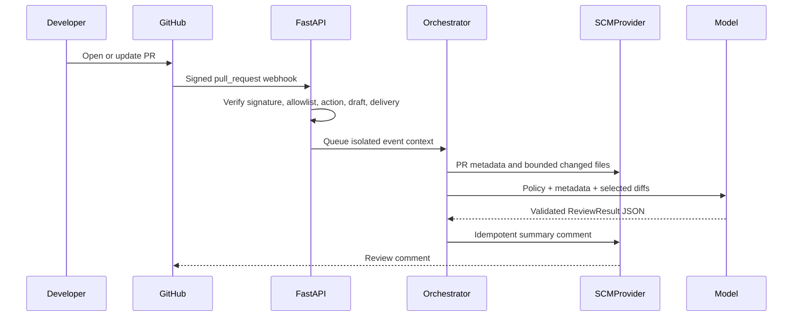
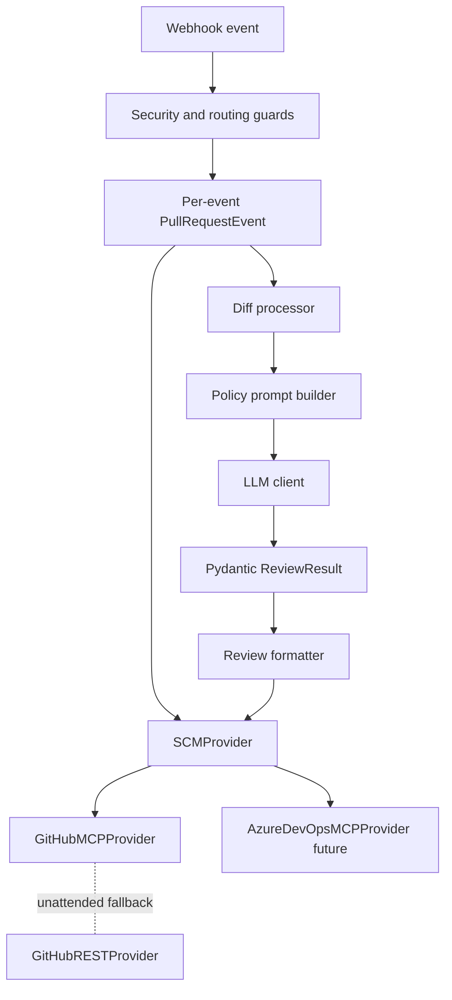

# Architecture

The webhook event carries owner, repository, PR number, SHA, branch, and delivery ID. No PR-specific data is global. The process is concurrency-friendly for the POC and can move `background_tasks.add_task` to Azure Service Bus, RabbitMQ, Redis Queue, or Kafka without changing the review boundary.

The official GitHub MCP server is configured for VS Code in `.vscode/mcp.json`. A standalone Python webhook process does not receive the MCP host's live tool session, so REST fallback is isolated behind `GitHubMCPProvider`. An MCP SDK client can replace that adapter later.
