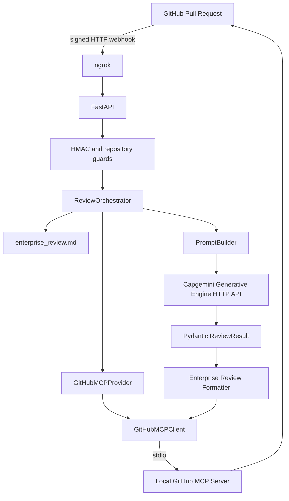
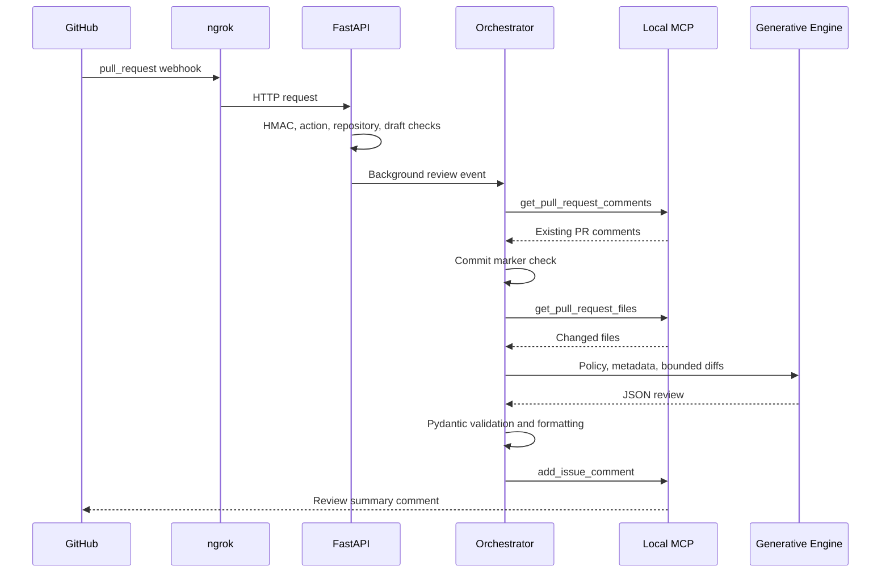
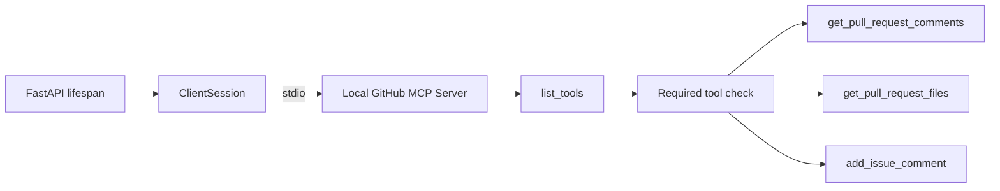
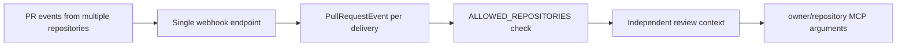

# Final Architecture

## Runtime Boundaries

- **Webhook transport:** HTTP from GitHub, exposed locally through ngrok.
- **Application:** FastAPI receives, authenticates, filters, and queues pull-request events.
- **GitHub integration:** MCP only, through `GitHubMCPProvider` and `GitHubMCPClient`.
- **MCP transport:** Local stdio process started by the Python application.
- **AI inference:** HTTP request to the Capgemini Generative Engine.
- **Review action:** MCP `add_issue_comment` posts the formatted result.

## System Architecture

## Pull-Request Sequence

## MCP Flow

The required tool set is configured by `GITHUB_MCP_TOOLS`. The verified demo set is `get_pull_request_comments,get_pull_request_files,add_issue_comment`.

## Multi-Repository Flow

No repository-specific state is stored in the orchestrator. Each event carries its own owner, repository, PR number, branch, commit SHA, and delivery ID.

## Health Endpoint

`GET /health` returns a simple service status. It does not replace MCP startup validation; the application startup waits for MCP connection and required-tool discovery.
